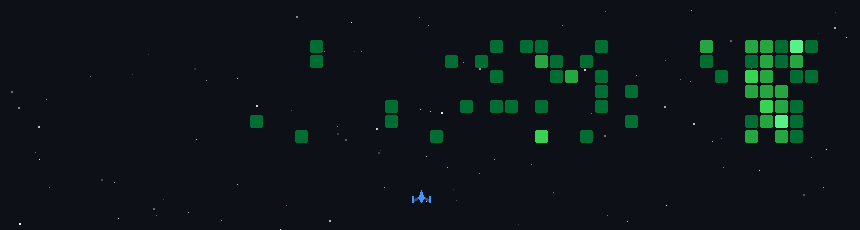

  

<h3 align="center">AI Enthusiast | Open Source Contributor | Lifelong Learner</h3>

  

Hi  My name is Mr Jacks
=================================================================================================================================

🎓 Engineering Student | 💻 Full-Stack Developer | 🤖 AI & Cloud Enthusiast
---------------------------------------------------------------------------

I’m a passionate developer who loves building real-world, production-ready applications using modern web technologies.

From hackathons to full-stack deployments, I focus on learning by building.

* 🌍  I'm based in India
* 🖥️  See my portfolio at [My Portfolio](#)
* ✉️  You can contact me at [your_email@example.com](mailto:your_email@example.com)
* 🚀  I'm currently working on Awesome Projects
* 🧠  I'm currently learning Advanced full-stack development, system design, and cloud deployment
* 👥  I'm looking to collaborate on Startup ideas, SaaS products, AI + web development projects
* 💬  Ask me about I believe in building real products, not just demo projects -🚀Always building. Always learning.

### Socials

 <a href="https://www.github.com/chjagadeeshgdvl-art" target="_blank" rel="noreferrer"> <picture> <source media="(prefers-color-scheme: dark)" srcset="https://raw.githubusercontent.com/danielcranney/readme-generator/main/public/icons/socials/github-dark.svg" /> <source media="(prefers-color-scheme: light)" srcset="https://raw.githubusercontent.com/danielcranney/readme-generator/main/public/icons/socials/github.svg" />  </picture> </a> <a href="https://www.linkedin.com/in/YOUR_LINKEDIN_USERNAME" target="_blank" rel="noreferrer"> <picture> <source media="(prefers-color-scheme: dark)" srcset="https://raw.githubusercontent.com/danielcranney/readme-generator/main/public/icons/socials/linkedin-dark.svg" /> <source media="(prefers-color-scheme: light)" srcset="https://raw.githubusercontent.com/danielcranney/readme-generator/main/public/icons/socials/linkedin.svg" />  </picture> </a> <a href="https://www.x.com/YOUR_TWITTER_USERNAME" target="_blank" rel="noreferrer"> <picture> <source media="(prefers-color-scheme: dark)" srcset="https://raw.githubusercontent.com/danielcranney/readme-generator/main/public/icons/socials/twitter-dark.svg" /> <source media="(prefers-color-scheme: light)" srcset="https://raw.githubusercontent.com/danielcranney/readme-generator/main/public/icons/socials/twitter.svg" />  </picture> </a>  

# ■ My GitHub Activity Game

### Badges

<b>My GitHub Stats</b>

<b>Top Repositories</b>

  
  

       

     

### Support Me

<ul style="list-style-type: none; margin: 0;">
<li style="display: inline-block; margin-right: 0.25rem;"></li>
</ul>
